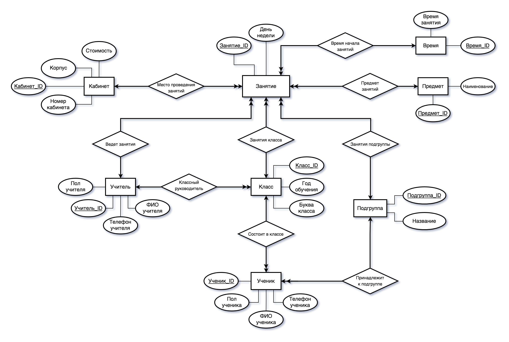
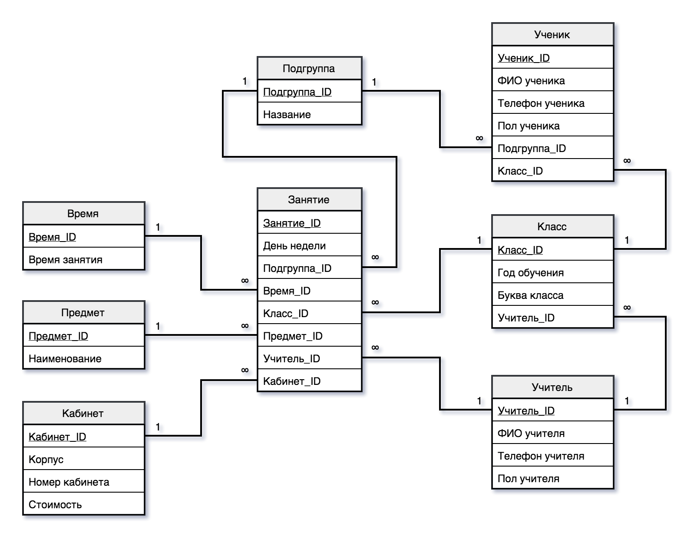
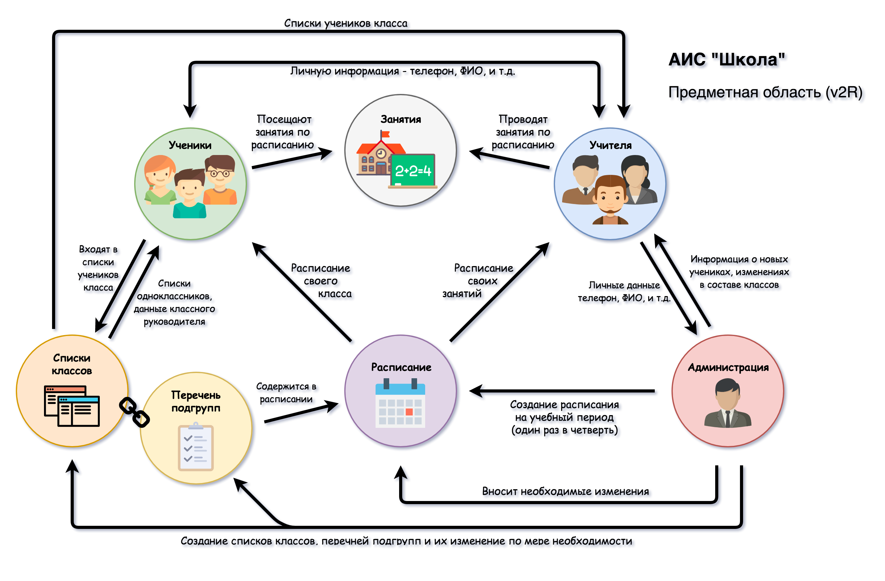
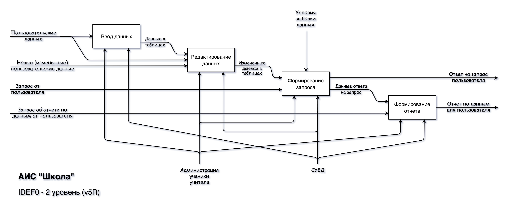
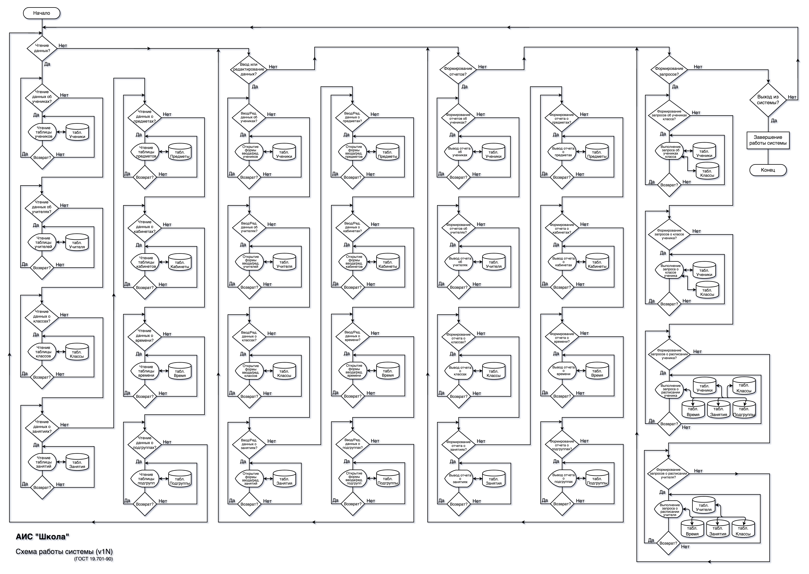

# АИС "Школа"

<p align="right">ИУ5-34, МГТУ им Н.Э. Баумана</p> 
<p align="right">Кучеренко "SnipGhost" Михаил</p>

### Структура репозитория

```
./
├─── bak       // Резервные копии
│    └─── ...
│
├─── doc       // Отчеты, какие нашел
│    └─── ...
│
├─── img       // PNG-представление схем (для отчетов)
│    └─── ...
│
├─── scm       // XML-представление схем (для draw.io)
│    └─── ...
│
├─── src       // Методички и скрипты
│    └─── ...
│
├─── DB-School.accdb        // Непосредственно макет
├─── DB-School.accdb.lnk    // Ярлык для user-запуска
└─── README.md              // То, что вы сейчас читаете
```

### Инфологическая модель макета АИС



### Даталогическая модель макета АИС



### Схемы для ДЗ №2









